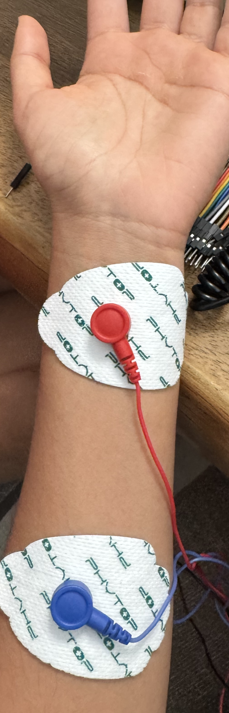
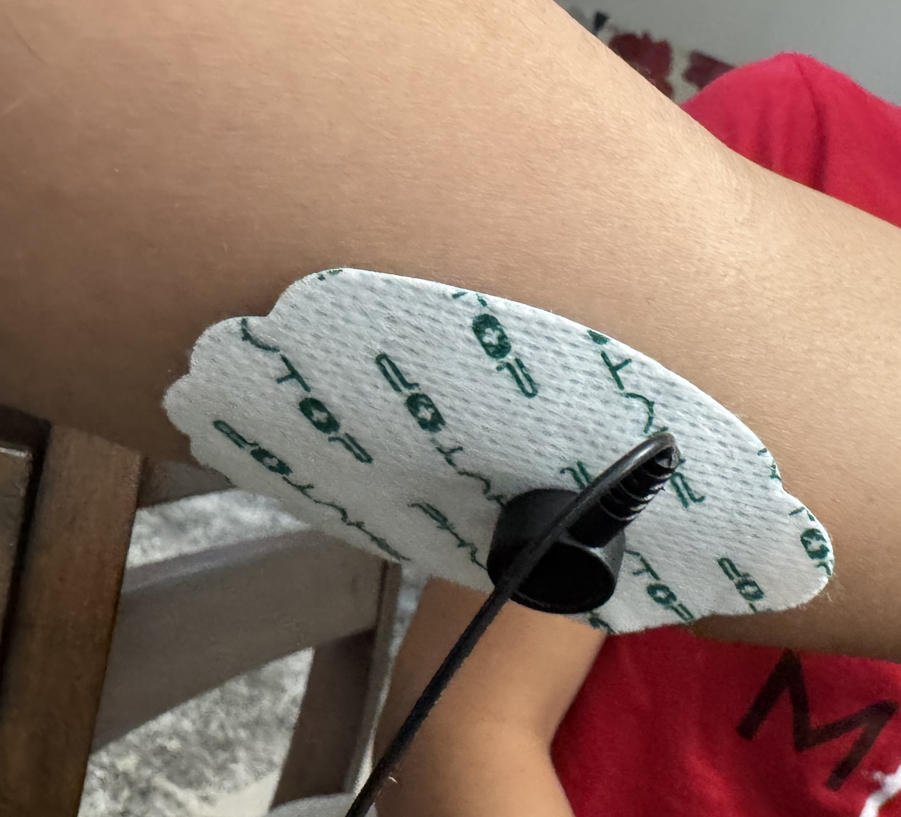

# Myonix
A wearable rehabilitation sleeve designed to gamify forearm exercises by combining muscle activity sensing (EMG) with cognitive load monitoring (EDA and heart rate). The system adapts exercise difficulty in real-time using lightweight machine learning, providing an AI-driven coach that distinguishes between physical fatigue and mental effort.

**PROTOTYPE IN DEVELOPMENT**

---

## Progress Updates

### 10/16 — Full Sensor Integration 🚀

✅ **Integrated EMG + EDA + IMU (MPU6050) Testing**

- Successfully interfaced all three sensors — **Electromyography (EMG)**, **Electrodermal Activity (EDA)**, and **Inertial Measurement Unit (IMU)** — with the ESP32 Wrover-E module.  
- During **grip exercises (wrist muscle activation)**:  
  - **EDA**: Voltage values decrease as skin/sweat conductance increases with activity.  
  - **EMG**: Clear spikes detected on muscle activation, synchronized with LED indicator.  
  - **IMU**: Acceleration and gyro readings show movement consistency with EMG activity.  
- Data collection validated across all three channels (EMG, EDA, IMU).

🎥 [Watch full integration demo](./sensors_integration.mp4)  

### 9/19 — Hardware & Signal Integration 🚀

✅ **Integrated EMG + EDA Testing**

- Successfully tested **Electromyography (EMG)** and **Electrodermal Activity (EDA)** sensors with ESP32.  
- During **grip exercises** (wrist muscle activation):  
  - **EDA**: Voltage values decrease as skin/sweat conductance increases with activity.  
  - **EMG**: Clear spikes detected on muscle activation.  
- **LED indicator** lights up on EMG activation.  

🎥 [Watch demo video](EDA_EMG%20Integration.mp4)  

---

### 📍 EMG Electrode Placement
Proper electrode placement is critical for clean signal capture.  

  
  

📝 _Tip: Document electrode reference (ground), mid, and end positions for consistency across tests._  

---

### 💾 Data Collection

- Latest dataset recorded from full sensor integration:  
  📂 [`emg_eda_imu_data.csv`](./emg_eda_imu_data.csv)  
  _(Raw readings from EMG, EDA, and IMU — preprocessing and filtering to follow.)_

---

### 🔜 Next Steps
- Begin **signal preprocessing** with our initial dataset for baseline understanding of data and gauge of success:
  - Filtering (low/high-pass, smoothing)
  - Feature extraction for EMG bursts, EDA changes, and IMU motion events  
- Develop **data fusion algorithms** for combined physical + cognitive state estimation  
- Explore **machine learning classification** for stress/effort detection  

---

### 📂 Reference Code
- Main test script: [`emg_eda_imu_test`](./emg_eda_imu_test.ino)  
